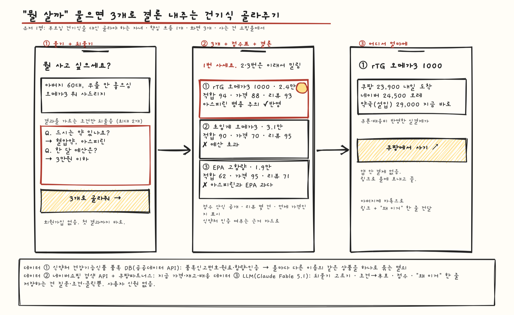

# Pitch

## Problem

8월 말, 아버지가 "무릎에 좋다는 오메가3 하나 사다 줘"라고 하셨다. 네이버에 "오메가3 추천"을 쳤더니 상위는 전부 광고와 제휴 블로그였다. 쿠팡으로 옮겨 상세페이지 다섯 개를 탭으로 열어 놓고 EPA·DHA 함량, rTG인지, 가격을 메모장에 옮겨 적었다. 30분쯤 지났을 때 아버지가 혈압약과 저용량 아스피린을 드신다는 게 생각났고, 오메가3를 같이 먹어도 되는지는 어느 상세페이지에도 없었다. 챗GPT에 물으니 "의사와 상담하세요"와 브랜드 이름 몇 개가 나왔다. 결국 쿠팡 판매량 1위를 그냥 샀다. 그게 아버지 조건에 맞는 건지는 지금도 모른다.

## Who else?

아버지 본인. 내가 사드리기 전에 직접 사신 마지막 건은 올봄 TV 홈쇼핑에서 본 관절 영양제를 전화로 주문한 것이었다. 성분도 가격도 비교하지 않았고, "귀찮아서 그냥 샀다"고 하셨다. 그 뒤로는 나한테 넘기신다. 비교하는 일 자체가 부담이라 결정을 미루거나 남에게 넘기는 것이다.

## Existing solutions

- 네이버쇼핑·쿠팡 검색: 수백 개를 나열한다. 광고가 먼저고, 성분 비교는 내가 손으로 해야 한다.
- 챗GPT·퍼플렉시티: 일반론과 브랜드 나열. 지금 가격, 재고, 내 조건(복용약·예산)을 반영한 결론이 없다.
- 네이버 AI 쇼핑 에이전트: 조건형 질문을 받지만 네이버 안 상품·리뷰만 본다.
- 약국: 약사가 있는 것만 권한다. 비교가 아니고, 비싸다.

공통점은 "골라 주는" 곳이 없다는 것. 나열하거나, 일반론을 말하거나, 한 곳 물건만 판다.

## Solution

질문창 하나. "아버지 60대, 무릎 안 좋으심, 오메가3 뭐 사드리지"라고 치면 결과를 가르는 조건 두 개만 되묻는다(드시는 약, 예산). 그러면 수백 개 중 3개를 골라 점수표(적합도·가격·리뷰 신뢰도)와 함께 "1번 사세요, 2·3번은 이래서 밀렸습니다"라고 결론을 낸다. 누르면 그 상품을 지금 제일 싸게 파는 몰의 실결제가와 배송일이 나오고, 몰로 보낸다. 사는 건 몰에서 한다.

데이터는 세 곳에서 온다. 식약처 건강기능식품 품목 DB(공공데이터 API)에서 품목신고번호·원료·함량·인증을 가져와 몰마다 이름이 다른 같은 상품을 하나로 묶는다. 네이버쇼핑 검색 API와 쿠팡파트너스에서 지금 가격·재고·배송을 가져온다. LLM(Claude Fable 5.1)이 되물을 조건을 고르고, 조건에 맞는 후보를 점수 매기고, "왜 이거"를 한 줄로 쓴다. 저장하는 건 질문·조건·클릭뿐이고 회원가입은 없다.

## No-gos

- 앱 안 결제와 장바구니. 결제는 몰로 보낸다.
- 브랜드용 대시보드(우리 상품이 왜 몇 번째로 골라졌는지). 소비자 화면만 만든다.
- 가격 알림, 재구매 알림, 구독. 한 번 묻고 한 번 사면 끝.
- 건기식 외 카테고리. 오메가3·관절·유산균처럼 식약처 품목 키가 있는 것만.
- 기능성 문구 생성. "무릎에 좋다"류 표현은 표시광고 규제 대상이라 식약처가 인정한 기능성 문구만 그대로 보여 준다. 복용약 상호작용은 경고까지만 하고 판단은 하지 않는다.
- 로그인, 프로필, 대화 기록.
