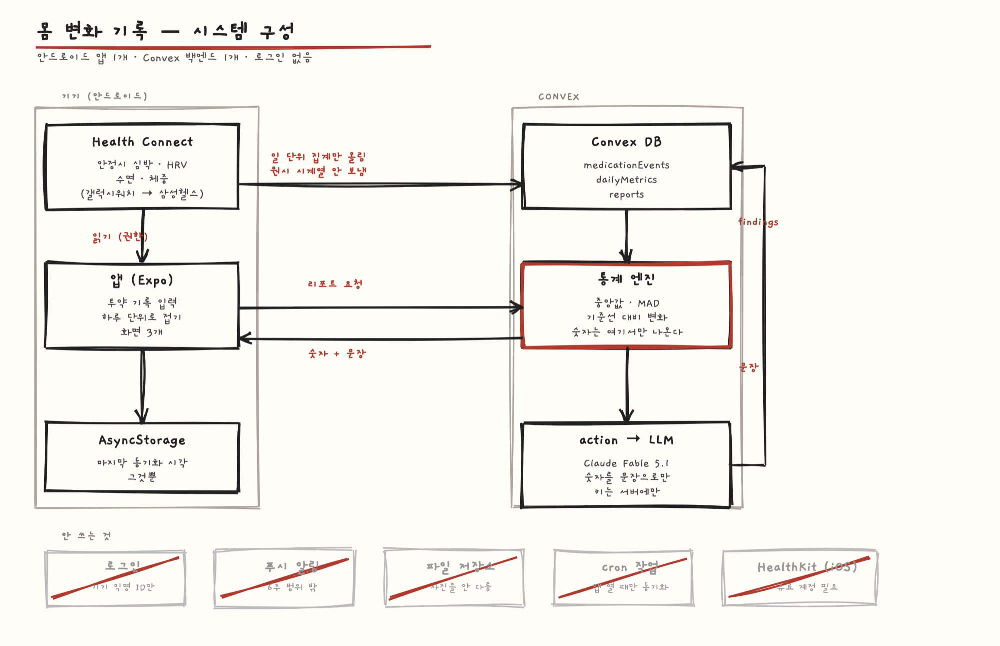

# System Design

GLP-1 투약 전후의 몸 변화를 워치 데이터로 보여 주는 안드로이드 앱.

## Overview

앱 하나와 백엔드 하나. 앱은 Health Connect에서 지표를 읽고 투약 기록을 받는다. 백엔드는 두 가지 때문에 필요하다. 첫째, 기기를 바꾸거나 앱을 지워도 투약 이력이 남아야 한다. 이 앱은 과거 기준선이 없으면 아무것도 계산하지 못한다. 둘째, LLM 키를 앱에 넣을 수 없다. `EXPO_PUBLIC_`으로 시작하는 값은 앱 안에 그대로 보인다.

백엔드는 Convex를 쓴다. 로그인은 넣지 않는다. 기기마다 익명 ID를 하나 만들어 쓰고, 건강 데이터를 계정과 엮지 않는다.

## Diagram

## Core flow

증량을 기록하고 2주 뒤 변화를 보는 흐름이다.

1. 사용자가 약·용량·날짜를 입력한다 → **앱**이 Convex mutation을 부른다
2. **Convex**가 `medicationEvents`에 저장한다
3. 앱이 열릴 때 **앱**이 Health Connect에서 마지막 동기화 이후의 기록을 읽는다
4. **앱**이 하루 단위로 접어서(분 단위 원시 시계열은 보내지 않는다) Convex mutation으로 올린다
5. 사용자가 리포트를 연다 → **Convex action**이 기준선 14일과 이후 창을 꺼내 엔진에 넣는다
6. **엔진**이 중앙값과 MAD로 변화를 계산한다 → 숫자가 나온다
7. **Convex action**이 그 숫자만 LLM에 넘겨 문장을 받는다 → **앱**이 화면에 그린다

## Data

Convex 테이블 셋.

`medicationEvents`: `deviceId`, `drug`, `doseMg`, `takenOn`, `kind`(START·DOSE_UP·DOSE_DOWN·MAINTAIN·STOP), `note`
키: `deviceId` + `takenOn` + `drug`. 같은 날 같은 약을 두 번 맞지 않는다.

`dailyMetrics`: `deviceId`, `date`, `restingHr`, `hrvRmssd`, `sleepMinutes`, `weightKg`, `wearMinutes`
키: `deviceId` + `date`. 하루에 한 행. 다시 올라오면 `wearMinutes`가 큰 쪽을 남긴다.

`reports`: `deviceId`, `eventId`, `windowDays`, `rulesetVersion`, `findings`, `narrative`
키: `deviceId` + `eventId` + `windowDays` + `rulesetVersion`. 규칙이 바뀌면 다른 행이 된다.

`findings`에만 숫자가 있고 `narrative`는 그것을 읽어 만든 문장이다. 문장 생성을 바꿔도 숫자는 재현된다.

기기에는 마지막 동기화 시각만 AsyncStorage에 둔다. SecureStore는 쓰지 않는다. 앱에 비밀 값이 없기 때문이다.

## Data sources

**Health Connect** (`react-native-health-connect` 4.1.3)

- 방법: 안드로이드 기기 API, 권한 필요
- 읽는 것: `RestingHeartRate`, `HeartRateVariabilityRmssd`, `SleepSession`, `Weight`
- 불러본 결과: `docs/samples/health-connect-typecheck.txt` — 실제 패키지를 설치해 위 네 레코드를 읽는 코드를 쓰고 타입 체크를 통과시켰다. 레코드 이름과 응답 필드(`beatsPerMinute`, `heartRateVariabilityMillis`, `weight.inKilograms`)가 실재함을 확인했다. 기기에서의 실제 수신은 development build를 받은 뒤 확인한다.
- 한계: **Expo Go에서 안 된다.** 네이티브 모듈이라 development build가 필요하다. `minSdkVersion 26`. 기기에 Health Connect 앱이 있어야 하고, Android 14 미만은 사용자가 Play 스토어에서 따로 깔아야 한다. 백그라운드 읽기는 `READ_HEALTH_DATA_IN_BACKGROUND`, 30일 이전 데이터는 `READ_HEALTH_DATA_HISTORY`가 각각 필요하고 **Play 심사 대상**이다.
- 언제: 앱을 열 때 마지막 동기화 이후만
- 막히면: 워치가 Health Connect에 안 넣어 주는 경우가 있다. 그때는 수동 입력으로 떨어진다.

**LLM** (Claude Fable 5.1) — Convex action에서만 호출한다. 키는 `npx convex env set`으로 넣는다. 숫자는 넘기지 않고 엔진이 만든 `findings` 객체만 넘긴다.

## Decisions

### iOS를 만들지 않는다
선택지 iOS+Android · Android만 · 워치 없이 수동 입력만
고른 것 Android만. HealthKit은 무료 Apple 계정에서 막혀 있어 유료 계정이 있어야 열린다. 6주 안에 양쪽을 하느니 한쪽을 제대로 한다.
대가 아이폰 사용자를 못 받는다. 11/14 배포는 Play 스토어만 한다.

### 숫자를 만드는 곳과 문장을 만드는 곳을 나눈다
선택지 LLM이 데이터를 보고 리포트를 다 쓰기 · 엔진이 계산하고 LLM은 문장만
고른 것 후자. 식약처 웰니스 기준상 약 선택을 지시하면 의료기기가 된다. LLM에 판단을 맡기면 그 선을 지킬 수 없다. 엔진이 만든 객체만 넘기고, 출력에 없는 숫자가 나오면 버리고 템플릿으로 떨어뜨린다.
대가 문장이 덜 자연스럽다. 가드 코드가 는다.

### 평균 대신 중앙값과 MAD
선택지 평균±표준편차 · 중앙값±MAD · t검정 같은 추론
고른 것 중앙값과 MAD. 착용을 하루 빼먹거나 운동을 심하게 한 하루가 결과를 흔들면 안 된다. 추론은 하지 않는다. 표본이 내 2주치뿐이라 "유의하다"고 말할 근거가 없다.
대가 데이터가 모자라면 "아직 모름"이 자주 뜬다. 정직하지만 첫 2주 인상이 비어 보인다.
